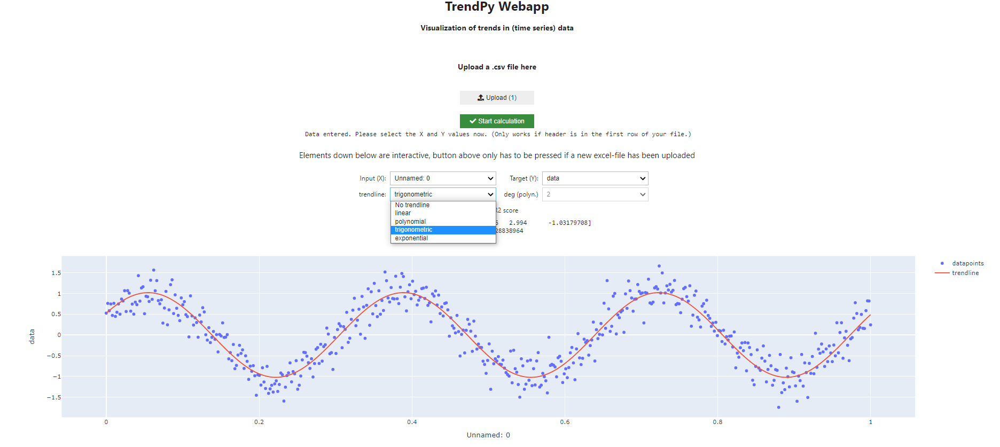

Jupyter Lab: [](https://mybinder.org/v2/gh/zolabar/trendPy/HEAD)

Voila Web App: [](https://mybinder.org/v2/gh/zolabar/trendPy/HEAD?urlpath=voila%2Frender%2F/TrendPy_Webapp.ipynb)

Use the package **TrendPy** as shown in the ```example.ipynb``` to use linear, polynomial, exponential or trigonometric regressions or use the **WebApp** with the correspondig button above.



