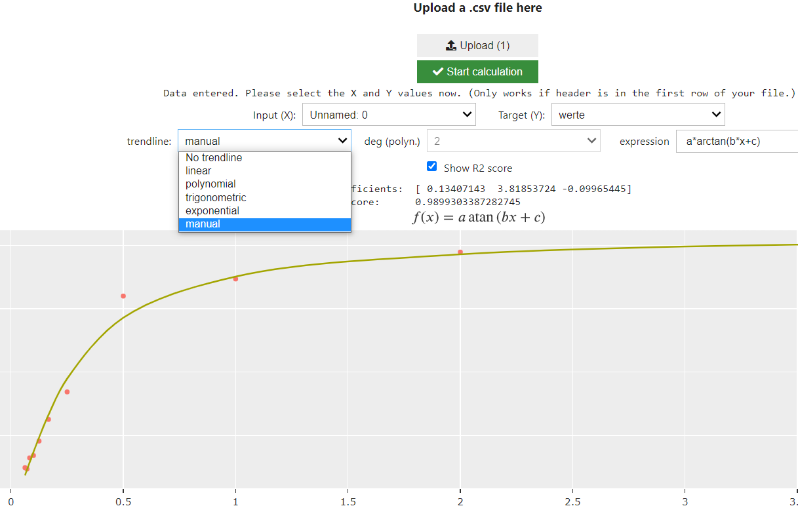

[](https://doi.org/10.5281/zenodo.7009281) Jupyter Lab:   [](https://mybinder.org/v2/gh/zolabar/trendPy/HEAD) Documentation: [](https://zolabar.github.io/trendPy/) WebApps: [](https://mybinder.org/v2/gh/zolabar/trendPy/HEAD?urlpath=voila%2Frender%2F/trendpy_webapp.ipynb) (binder) [](https://trendpy.herokuapp.com/) (Heroku) 


Use the package **TrendPy** as shown in the ```example.ipynb``` to use 

* linear 
* polynomial
* exponential 
* trigonometric 
* "free" (with three parameters) (e.g.```a*arctan(b*x+c)```, ```a*exp(b*x+c)```, ```a*(x*b)+c```)

regressions in your Python scripts or jupyter notebooks or use the **WebApp** with the correspondig button above.

For more, have a look at the [**sphinx-documentation**](https://zolabar.github.io/trendPy/)!



