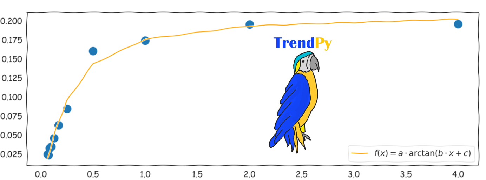

[](https://doi.org/10.5281/zenodo.7009281) Jupyter Lab:   [](https://mybinder.org/v2/gh/zolabar/trendPy/HEAD) Documentation: [](https://zolabar.github.io/trendPy/) WebApps: [](https://mybinder.org/v2/gh/zolabar/trendPy/experimental?urlpath=voila%2Frender%2F/trendpy_webapp.ipynb) (binder) 


Use the package **TrendPy** as shown in the ```example.ipynb``` to use 

* linear $f(x)=a\cdot x+b$
* polynomial $f(x)=a_n\cdot x^n+a_{n-1}\cdot x^{n-1}+...+a_0$
* exponential $f(x)=a\cdot e^{b\cdot x}$
* trigonometric $f(x)=a\cdot \cos(2\cdot \pi\cdot b\cdot x+c)$
* "free" (for max. three parameters) (e.g.```a*arctan(b*x+c)```, ```a*exp(b*x+c)```, ```a*(x*b)+c```), the intial guess for a, b, c is 1.

regressions in your Python scripts or jupyter notebooks or use the **WebApp** with the correspondig button above.

For more, have a look at the [**sphinx-documentation**](https://zolabar.github.io/trendPy/)!

The webApp is listed in the [Voila Gallery](https://voila-gallery.org/)!


